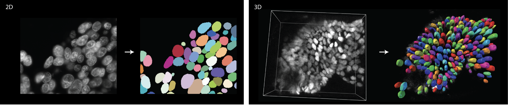

---
hide:
  - navigation
  - toc
---

# StarDist - Object Detection with Star-Convex Polygons



This web site provides answers to [frequently asked questions (FAQ)](faq.md) when using StarDist.

Please visit the [main stardist project page](https://github.com/stardist/stardist/) for general documentation, installation instructions, and issue reports. 


If you are using StarDist in your research please cite the relevant paper(s):

```bibtex
@inproceedings{schmidt2018,
  author    = {Uwe Schmidt and Martin Weigert and Coleman Broaddus and Gene Myers},
  title     = {Cell Detection with Star-Convex Polygons},
  booktitle = {Medical Image Computing and Computer Assisted Intervention - {MICCAI} 
  2018 - 21st International Conference, Granada, Spain, September 16-20, 2018, Proceedings, Part {II}},
  pages     = {265--273},
  year      = {2018},
  doi       = {10.1007/978-3-030-00934-2_30}
}

@inproceedings{weigert2020,
  author    = {Martin Weigert and Uwe Schmidt and Robert Haase and Ko Sugawara and Gene Myers},
  title     = {Star-convex Polyhedra for 3D Object Detection and Segmentation in Microscopy},
  booktitle = {The IEEE Winter Conference on Applications of Computer Vision (WACV)},
  month     = {March},
  year      = {2020},
  doi       = {10.1109/WACV45572.2020.9093435}
}

@inproceedings{weigert2022,
  author    = {Martin Weigert and Uwe Schmidt},
  title     = {Nuclei Instance Segmentation and Classification in Histopathology Images with Stardist},
  booktitle = {The IEEE International Symposium on Biomedical Imaging Challenges (ISBIC)},
  year      = {2022},
  doi       = {10.1109/ISBIC56247.2022.9854534}
}
```
